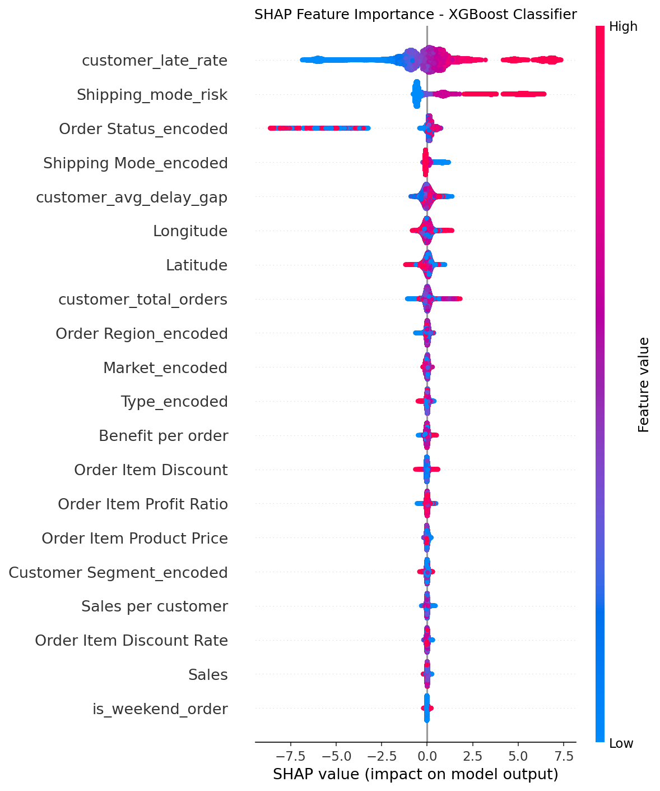

# Supply Chain Risk Engine

>> Built a multi-stage machine learning pipeline that predicts shipment delays, estimates delay severity, explains model decisions with SHAP, and segments customers into risk tiers using 180,000+ real-world supply chain records.

### Live Demo

**Application:** https://supply-chain-risk-engine.streamlit.app/

---

## Problem Statement

Late deliveries impact revenue, customer satisfaction, and operational efficiency.

Most logistics systems react after a delay occurs. This project focuses on identifying high-risk shipments before they leave the warehouse, allowing operations teams to take preventive action.

---

## Solution Overview

The project combines classification, regression, clustering, and explainable AI into a single workflow.

```text
New Shipment Order
        │
        ▼
Stage 1: Delay Classification
XGBoost Classifier
(AUC-ROC: 0.93)

        │
        ▼
Stage 2: Delay Severity Estimation
Random Forest Regressor
(MAE: 0.47 Days)

        │
        ▼
Stage 3: Customer Risk Segmentation
K-Means Clustering
(4 Risk Tiers)

        │
        ▼
SHAP Explainability
```

---

## Results

| Task                      | Model         | Metric   | Score             |
| ------------------------- | ------------- | -------- | ----------------- |
| Delay Classification      | XGBoost       | AUC-ROC  | 0.93              |
| Delay Classification      | XGBoost       | F1 Score | *Add Final Value* |
| Delay Severity Prediction | Random Forest | MAE      | 0.47 Days         |
| Delay Severity Prediction | Random Forest | R² Score | 0.456             |
| Customer Segmentation     | K-Means       | Clusters | 4                 |

---

## Key Insights

* First Class shipping exhibits the highest late-delivery rate.
* Customer delivery history is the strongest predictor of future delays.
* Delay patterns are driven more by shipping mode and customer geography than by seasonality.
* SHAP analysis highlights shipping mode, customer late rate, and order status as the most influential features.

---

## Explainability with SHAP



The classification model is fully explainable using SHAP (SHapley Additive exPlanations).

SHAP enables both:

* Global feature importance analysis
* Individual shipment-level explanations

This helps users understand not only what the model predicts, but why it makes each prediction.

---

## Project Structure

```text
supply-chain-risk-engine/
│
├── app/
│   └── streamlit_app.py
│
├── notebooks/
│   ├── 01_eda.ipynb
│   ├── 02_feature_engineering.ipynb
│   ├── 03_classification.ipynb
│   ├── 04_regression.ipynb
│   └── 05_clustering.ipynb
│
├── models/
│   ├── xgb_classifier.pkl
│   ├── rf_regressor.pkl
│   └── kmeans_clustering.pkl
│
├── reports/
│   └── figures/
│       ├── shap_summary.png
│       ├── shap_waterfall.png
│       ├── cluster_pca.png
│       └── confusion_matrices.png
│
├── dataset/
│   └── processed/
│
├── requirements.txt
└── README.md
```

---

## Technology Stack

* Python
* Pandas
* NumPy
* Scikit-Learn
* XGBoost
* SHAP
* Streamlit
* Matplotlib

---

## Installation

```bash
git clone https://github.com/Mansha-Khod/supply-chain-risk-engine.git

cd supply-chain-risk-engine

pip install -r requirements.txt

streamlit run app/streamlit_app.py
```

---

## Dataset

Dataset used:

DataCo Smart Supply Chain Dataset

https://www.kaggle.com/datasets/shashwatwork/dataco-smart-supply-chain-for-big-data-analysis

The dataset contains over 180,000 shipment records covering customer orders, delivery performance, shipping methods, and supply chain operations.

---

## Business Impact

This project demonstrates how machine learning can support proactive supply chain decision-making.

### Delay Prevention

By identifying high-risk shipments before dispatch, operations teams can intervene early through route adjustments, carrier selection, or customer communication.

### Improved Customer Experience

Predicting delivery risk allows businesses to set realistic expectations and reduce customer dissatisfaction caused by unexpected delays.

### Resource Optimization

Risk-based prioritization helps teams focus attention on shipments most likely to experience delivery issues rather than treating all shipments equally.

### Explainable Decision Support

SHAP explanations provide transparency into model predictions, enabling analysts and operations managers to understand the factors driving shipment risk.

### Customer Risk Intelligence

Customer segmentation identifies groups with distinct delivery patterns, allowing businesses to tailor communication strategies and operational policies to different customer profiles.

### Potential Outcomes

* Reduced late-delivery rates
* Improved customer satisfaction and retention
* More efficient allocation of operational resources
* Faster identification of systemic logistics issues
* Increased trust in machine learning recommendations through explainability


```
```

